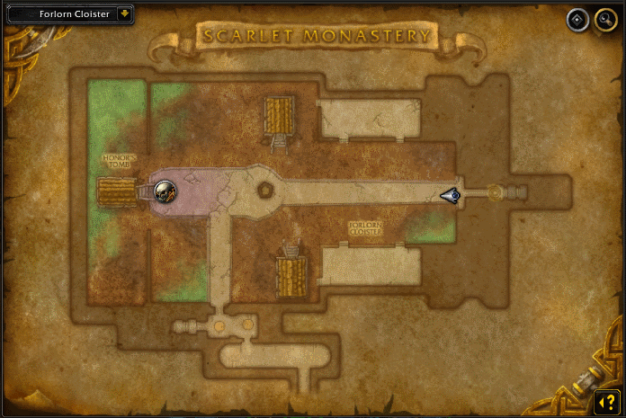
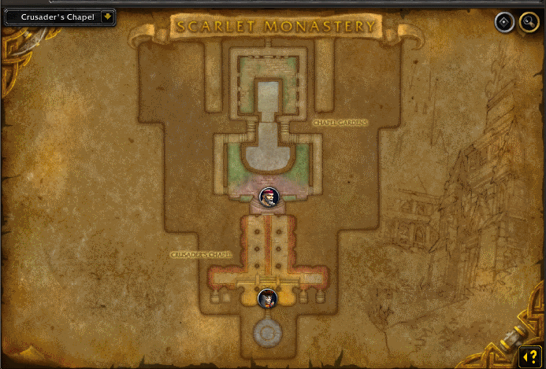

import PoolHigh from "@site/shared-content/poolhigh.mdx"

# Scarlet Monastary

## The Farm
Scarlet Monastery is a very simple dungeon that is mainly farmed for transmog. Some examples of items you want see while farming are:

- <WowHeadItem id="10332"></WowHeadItem>
- <WowHeadItem id="8225"></WowHeadItem>
- <WowHeadItem id="7754"></WowHeadItem>
- <WowHeadItem id="7729"></WowHeadItem>

## Getting There
The Scarlet Monastery is located in the northeast corner of Tristfal Glades.

### Alliance
To get there as an alliance character, you will make your way up to the flight point of Hearthglen in the Western Plaugelands.  Then you fly due west and can enter the monastery.

### Alliance - Druid
With a druid, you can <WowHeadSpell id="193753">Dreamwalk</WowHeadSpell> to the <WowHeadZone id="47">The Hinterlands</WowHeadZone> and take the flight path from Stormfeather Outpost to Hearthglen.

### Horde
For the horde, just take a portal to Undercity and then fly to the northeast corner of Tristfal Glades.

## The Route
You start in the Forlorn Cloister, where you need to kill the piles of corpses before moving on to the first boss of the instance while killing all mobs along the way. After killing the first boss, start making your way to the chapel.

Once you enter the chapel, take a left and start killing the mobs and looting as you go.  Make your way to Brother Korloff and put him to an end. That will open the doors to the chapel and allow you to kill all the mobs in there. Most people avoid the final boss, as there is some role play that takes time and really isn't worth the time. Make your way down the other side of the chapel area and run out of the instance, resetting after you exit the instance.  Reset and repeat.

## The Notable Drops

### World Drops
These world drops can drop in this dungeon, but the chance of a drop is very low.

<PoolHigh />

### Blues
These items are unique to Scarlet Monastary.

- <WowHeadItem id="7759" note="Archon Chestpiece"></WowHeadItem>
- <WowHeadItem id="7728" note="Beguiler Robes"></WowHeadItem>
- <WowHeadItem id="7753" note="Bloodspiller"></WowHeadItem>
- <WowHeadItem id="8226" note="The Butcher"></WowHeadItem>
- <WowHeadItem id="7729" note="Chesterfall Musket"></WowHeadItem>
- <WowHeadItem id="7730" note="Cobalt Crusher"></WowHeadItem>
- <WowHeadItem id="7752" note="Dreamslayer"></WowHeadItem>
- <WowHeadItem id="7755" note="Flintrock Shoulders"></WowHeadItem>
- <WowHeadItem id="7754" note="Harbinger Boots"></WowHeadItem>
- <WowHeadItem id="7736" note="Fight Club"></WowHeadItem>
- <WowHeadItem id="2262" note="Mark of Kern"></WowHeadItem>
- <WowHeadItem id="10332" note="Scarlet Boots"></WowHeadItem>
- <WowHeadItem id="5756" note="Sliverblade"></WowHeadItem>
- <WowHeadItem id="7761" note="Steelclaw Reaver"></WowHeadItem>
- <WowHeadItem id="5819" note="Sunblaze Coif"></WowHeadItem>
- <WowHeadItem id="1992" note="Swampchill Fetish"></WowHeadItem>
- <WowHeadItem id="8225" note="Tainted Pierce"></WowHeadItem>
- <WowHeadItem id="7727" note="Watchman Pauldrons"></WowHeadItem>
- <WowHeadItem id="7757" note="Windweaver Staff"></WowHeadItem>

### Sets

- [Banded](/misc/sets#banded)
- [Battleforge](/misc/sets#battleforge)
- [Durable](/misc/sets#durable)
- [Elegant](/misc/sets#elegant)
- [Glimmering Mail](/misc/sets#glimmering-mail)
- [Hyperion](/misc/sets#hyperion)
- [Imbuedplate](/misc/sets#imbuedplate)
- [Infiltrator](/misc/sets#infiltrator)
- [Masterwork](/misc/sets#masterwork)
- [Mercurial](/misc/sets#mercurial)
- [Sage](/misc/sets#sage)
- [Silver Thread](/misc/sets#silver-thread)
- [Travelers](/misc/sets#travelers)

## YouTube Videos
- [Studen Albatroz](https://www.youtube.com/watch?v=Kx_y8BeGV54)
- [Seathrift](https://www.youtube.com/watch?v=SU8GGQEz_m4)

