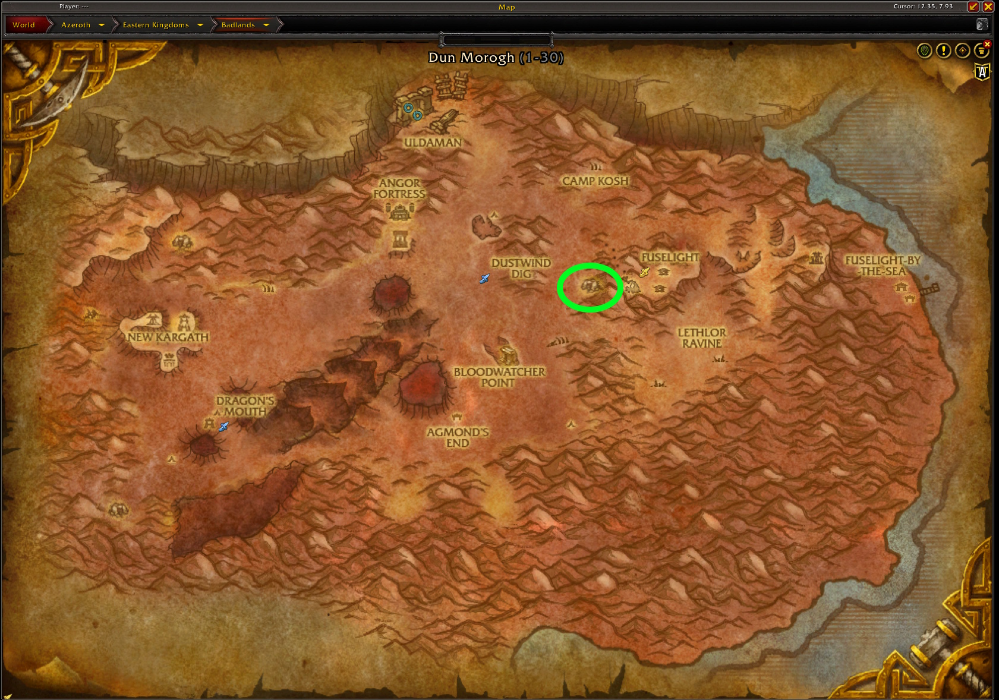
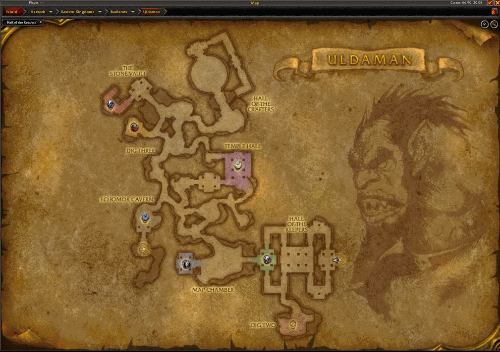

import PoolLow from "@site/shared-content/poollow.mdx"

# Uldaman
<WowHeadZone id="1337">Uldaman</WowHeadZone> is a popular dungeon for gold farming because of its super rare drops.  Some examples of items you want to encounter while farming Uldaman are:

- <WowHeadItem id="9465">Digmaster 5000</WowHeadItem>
- <WowHeadItem id="9429">Miner's Hat of the Deep</WowHeadItem>
- <WowHeadItem id="9431">Papal Fez</WowHeadItem>
- <WowHeadItem id="9425">Pendulum of Doom</WowHeadItem>
- <WowHeadItem id="9422">Shadowforge Bushmaster</WowHeadItem>
- <WowHeadItem id="9430">Spaulders of a Lost Age</WowHeadItem>
- <WowHeadItem id="9423">The Jackhammer</WowHeadItem>

## Getting There
Uldaman is located in the <WowHeadZone id="3">Badlands</WowHeadZone> zone in the Eastern Kingdoms.  

### Alliance
Take a flight path from either Stormwind or Ironforge to the Dustwind Dig flight path.  The cave is just east of the flight path.

### Horde
From the Orgrimmar portal room talk to the <WowHeadNpc id="150131">Thrallmar Mage</WowHeadNpc> in the lower portal room.  They will transport you to the Dark Portal. From there you can fly east to the Shattered Landing flight path.  Take that flight path to Fuselight in the Badlands.  The cave entrance is just a bit west of the flight path.

## The Route
Uldaman can be a confusing dungeon the first few times you run it, so take it slow and learn the path. Once you have it down, it is easy to find your way through this maze of a dungeon.

Most of the dungeon is on the "Hall" portion of the map, but the last boss is in the "Seat" section of the map.  

This is a kill and loot type dungeon, where you will kill and loot as you navigate through the dungeon. 

Upon entrance to Uldaman, you can either go left or right and take out the trash as you go, making your way to the first boss. Kill <WowHeadNpc id="6910">Revelosh</WowHeadNpc> and then proceed to Dig Two, killing Mobs along the way. Backtrack to Revelosh and kill all the mobs in the Map Chamber. You don't need to bother with <WowHeadNpc id="7228">Ironaya</WowHeadNpc> as there is a bit of role play and it's normally not worth it for a single extra loot.  

Next proceed towards Echomok Cavern, again, killing and looting as you go to take out the <WowHeadNpc id="7023">Obsidian Sentinel</WowHeadNpc>. Backtrack a bit again and make your way towards the Temple Hall, but ensuring you go in the little room right before it, as there is always a chest back there.  Go a bit past the temple hall to ensure you get all of the mobs in the next two rooms, before backtraking into the temple hall 3to kill the <WowHeadNpc id="7206">Ancient Stone Keeper</WowHeadNpc>. 

Next head towards Dig Three, killing the mobs along the way and checking the nooks and crannies for a few extra mobs.  Once you have dealt with <WowHeadNpc id="7291">Galgann Firehammer</WowHeadNpc>, work your way to <WowHeadNpc id="4854">Grimlok</WowHeadNpc> and take him out.  Now, you will proceed to the Hall of Crafters, again killing and looting as you go.  In the circle room you will ehave to do the Stone Keepers one at a time by clicking the Altar of the Keepers in the middle of the room.  Follow the path down to the final boss room where you will click on the Altar of Archadeas to begin the encounter.  Once defeated, go to the door that opened and be sure to loot the final chest of the dungeon.

At this point you have to leave and reset the dungeon. 

## The Notable Drops
Uldaman is a great place to farm up those super rare drops, but the rest of its loot table is rather lacking.  Here are some of the notable drops you could get in your Uldaman runs:

### Epics
<PoolLow />

### Blues

- <WowHeadItem id="9392">Annealed Blade</WowHeadItem>
- <WowHeadItem id="9465">Digmaster 5000</WowHeadItem>
- <WowHeadItem id="9424">Ginn-Su Sword</WowHeadItem>
- <WowHeadItem id="9396">Legguards of the Vault</WowHeadItem>
- <WowHeadItem id="9429">Miner's Hat of the Deep</WowHeadItem>
- <WowHeadItem id="9426">Monolithic Bow</WowHeadItem>
- <WowHeadItem id="9383">Obsidian Cleaver</WowHeadItem>
- <WowHeadItem id="9431">Papal Fez</WowHeadItem>
- <WowHeadItem id="9425">Pendulum of Doom</WowHeadItem>
- <WowHeadItem id="9422">Shadowforge Bushmaster</WowHeadItem>
- <WowHeadItem id="9432">Skullplate Bracers</WowHeadItem>
- <WowHeadItem id="9430">Spaulders of a Lost Age</WowHeadItem>
- <WowHeadItem id="9427">Stonevault Bonebreaker</WowHeadItem>
- <WowHeadItem id="9423">The Jackhammer</WowHeadItem>
- <WowHeadItem id="9428">Unearthed Bands</WowHeadItem>

### Sets
- [Aurora](/misc/sets#aurora)
- [Chief Brigadier's](/misc/sets#chief-brigadier)
- [Conjurer's](/misc/sets#conjurers)
- [Huntsman's](/misc/sets#hunstmans)
- [Jazeraint](/misc/sets#jazeraint)
- [Knight's](/misc/sets#knights)
- [Ranger](/misc/sets#ranger)
- [Sentinel](/misc/sets#sentinel)
  
## YouTube Videos
- [Studen Albatroz](https://www.youtube.com/watch?v=bKCvx3x5h68)
- [Persephonae](https://www.youtube.com/watch?v=yM2Su5BTMz4)