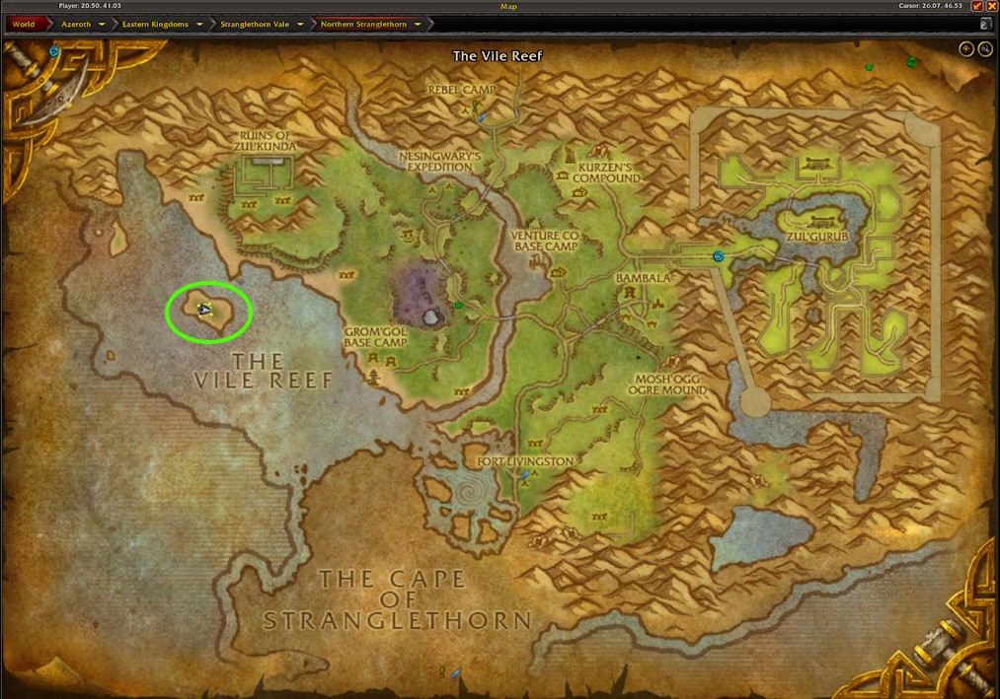
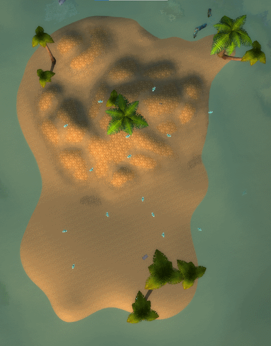
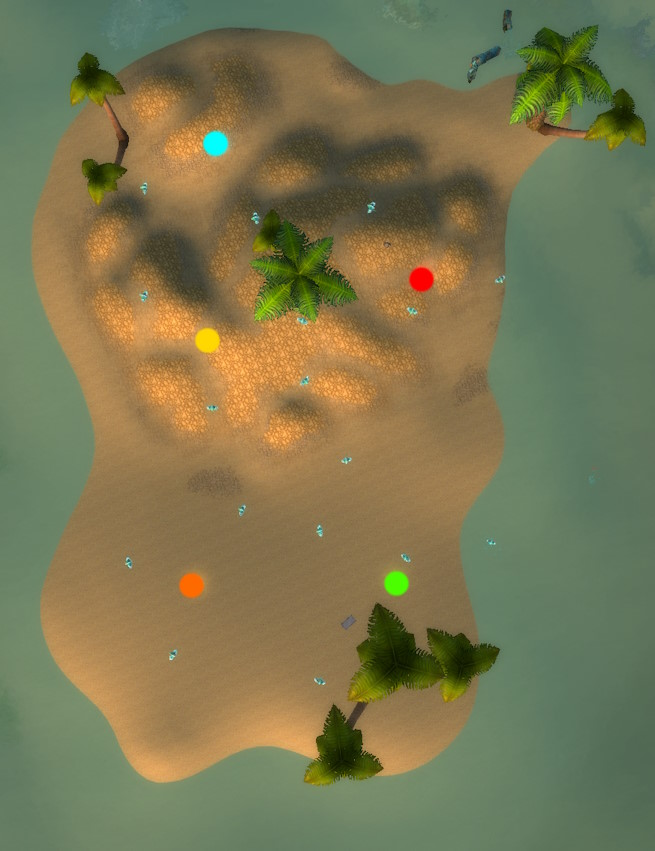

# Essence of Water
## The Farm
In this farm, you are targeting the crafting material <WowHeadItem id="7080">Essence of Water</WowHeadItem>. Patch 10.1.5 released [new crafting recipes](https://www.wowhead.com/news/naxxramas-returning-content-in-patch-10-1-5-ptr-ancient-recipes-new-mount-332939) causing <WowHeadItem id="7080">Essence of Water</WowHeadItem> to become a sought after commodity.  

For this farm, we will target <WowHeadNpc id="691">Lesser Water Elemental</WowHeadNpc> on an island just west of Grom'Gol Base Camp in the <WowHeadZone id="5339">Stranglethorn Vale</WowHeadZone> that respawn very quickly when farmed.  This farm can be done solo, but you will get better rates with at least 3 and up to 5.



## Getting There

### Alliance
Take the flight path from Stormwind to the Rebel Camp in the <WowHeadZone id="5339">Stranglethorn Vale</WowHeadZone>  and then fly southwest from there.

### Horde
Take the zepplin from Orgrimmar to Grom'gol in the <WowHeadZone id="5339">Stranglethorn Vale</WowHeadZone>. Fly west to the island.

## The Route
The route is a simple loop around the island you and all your friends loot and kill. You can do 2-3 loops before you have to loop.  Stay spread out to maximimize your kills per hour.



Alternatively, you can assign locations and have everyone kill for 90 seconds and then loot for 30 seconds before starting the farm again.  



### Macro
The following macro works for druids, but simply replace the `/use moonfire` with whatever spell your class uses for instant damage. This macro targets the <WowHeadZone id="691">Lesser Water Elemental</WowHeadZone> and casts Moonfire.  

```
#showtooltip
/tar lesser
/use moonfire
```

## The Loot
Your main target for this farm is the <WowHeadItem id="7080">Essence of Water</WowHeadItem> but you can still get world drops and some decent zone specific items.

- <WowHeadItem id="7080">Essence of Water</WowHeadItem>
- <WowHeadItem id="2955">First Mate Hat</WowHeadItem>
- <WowHeadItem id="8494">Parrot Cage (Hyacinth Macaw)</WowHeadItem>
- <WowHeadItem id="48126">Razzashi Hatchling</WowHeadItem>

## YouTube Videos
- [Boophie](https://www.youtube.com/watch?v=YW2Vj6B-cdM)
- [MaaniCrazyGold](https://www.youtube.com/watch?v=M_ZSyN_iewk)