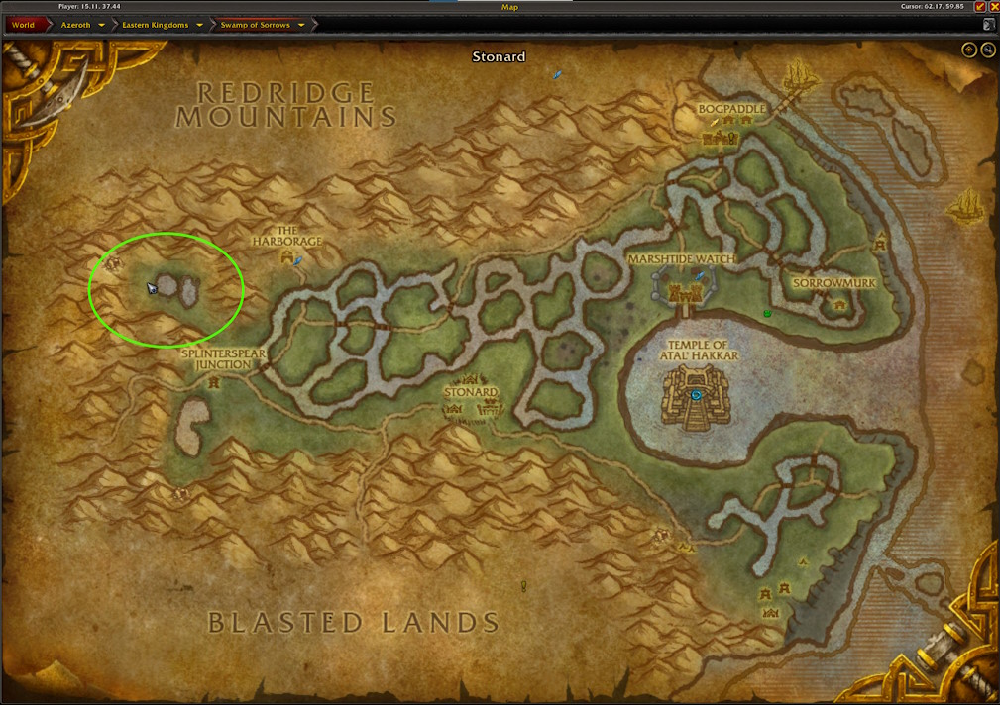
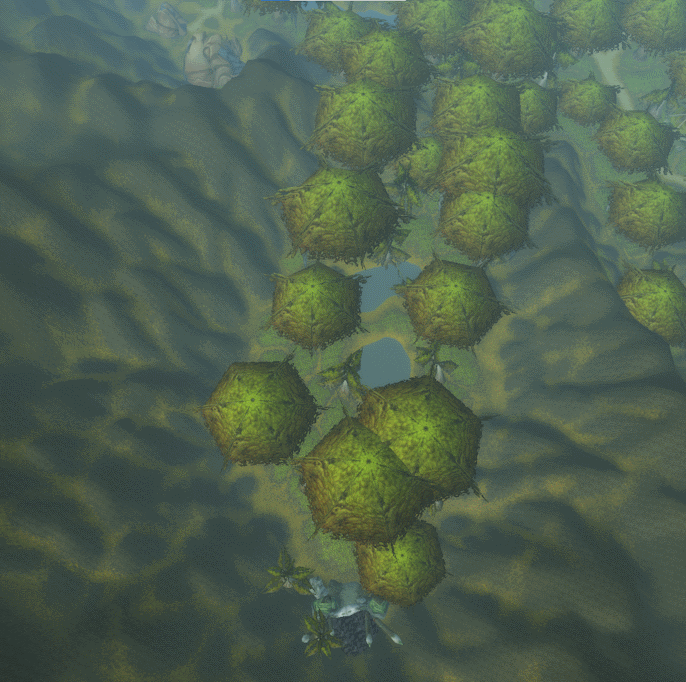

# Felcloth
## The Farm
In this farm, you are targeting the crafting material <WowHeadItem id="14256">Felcloth</WowHeadItem>. With the 10.1.5 patch that will contain [new crafting recipes](https://www.wowhead.com/news/naxxramas-returning-content-in-patch-10-1-5-ptr-ancient-recipes-new-mount-332939), the <WowHeadItem id="14256">Felcloth</WowHeadItem> has become a sought after commodity.  

For this farm, we will target <WowHeadNpc id="46950">Misty Grell</WowHeadNpc> in the northwest corner the <WowHeadZone id="8">Swamp of Sorrows</WowHeadZone> that respawn very quickly when farmed.  This farm can be done solo, but you will get better rates with at least 3 and up to 5.



## Getting There

### Alliance
Take the flight path from Stormwind to the Harborage in the <WowHeadZone id="8">Swamp of Sorrows</WowHeadZone>  and then fly over from there.

### Horde
Take the zepplin from Orgrimmar to Grom'gol in the <WowHeadZone id="5339">Stranglethorn Vale</WowHeadZone>. Take the flight path to the Stonard in the <WowHeadZone id="8">Swamp of Sorrows</WowHeadZone> and fly over from there.

### Horde - Druid
Use Dreamwalk and take the portal to Duskwood.  From there, you can fly due east to enter the <WowHeadZone id="8">Swamp of Sorrows</WowHeadZone>.

## The Route
The route is a simple loop where you and all your friends loot and kill. Stay spread out to maximimize your kills per hour.



### Macro
The following macro works for druids, but simply replace the `/use moonfire` with whatever spell your class uses for instant damage. This macro targets the <WowHeadNpc id="46950">Misty Grell</WowHeadNpc> and casts Moonfire.  

```
#showtooltip
/tar misty
/use moonfire
```

## The Loot
Your main target for this farm is the <WowHeadItem id="14256">Felcloth</WowHeadItem> and, to be honest, you will probably not get much else.  The Misty Grell don't always drop loot, so don't be surprised to see corpses with no loot attached to them.

With a five man group, you can expect somewhere around 200 <WowHeadItem id="14256">Felcloth</WowHeadItem> per hour.  Solo is closer to 70, so keep that in mind when looking at the price of <WowHeadItem id="14256">Felcloth</WowHeadItem> in your region.

## YouTube Videos
- [WTB Gold](https://youtu.be/hiRUyfxUNTY?t=152)
- [Boophie](https://www.youtube.com/watch?v=946w6tMRVyo)