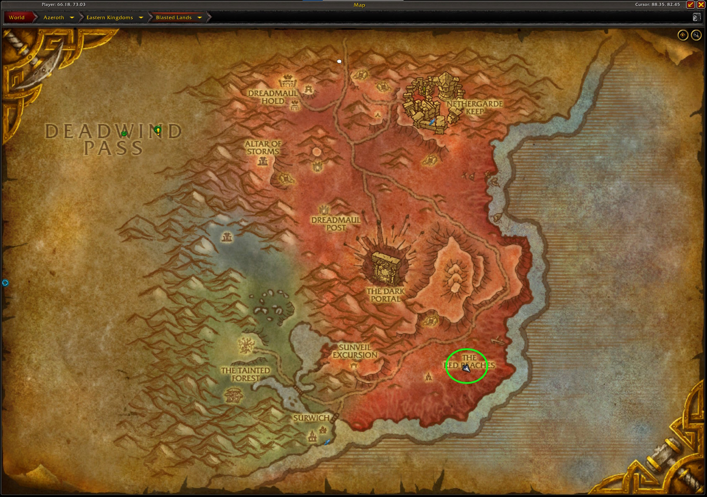
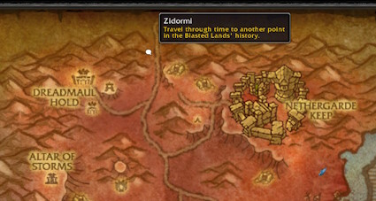
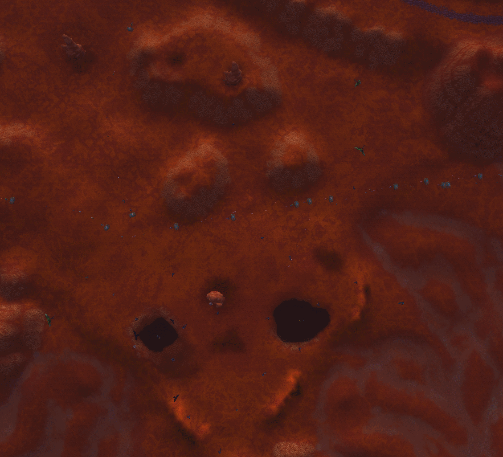

# Golden Pearls
## The Farm
In this farm, you are targeting the crafting material <WowHeadItem id="13926">Golden Pearl</WowHeadItem>. With the 10.1.5 patch, [new crafting recipes](https://www.wowhead.com/news/naxxramas-returning-content-in-patch-10-1-5-ptr-ancient-recipes-new-mount-332939) were released and the <WowHeadItem id="13926">Golden Pearl</WowHeadItem> has become a sought after commodity.  These items come from <WowHeadItem id="7973">Big-Mouth Clam</WowHeadItem> which drop from Naga throughout Vanilla WoW content.

For this farm, we will target a group of Naga in the Red Reaches of the <WowHeadZone id="4">Blasted Lands</WowHeadZone> that respawn relatively quickly when farmed in a 5 man group.



## Getting There

### Alliance
Take the flight path from Stormwind to the Shattered Beachead in the <WowHeadZone id="4">Blasted Lands</WowHeadZone> and then fly down from there.

### Horde
Take the zepplin from Orgrimmar to Grom'gol in the <WowHeadZone id="5339">Stranglethorn Vale</WowHeadZone>. Take the flight path to the Shattered Landing and fly south from there.

### Horde - Druid
Use Dreamwalk and take the portal to Duskwood.  From there, you can fly southeast to enter the <WowHeadZone id="4">Blasted Lands</WowHeadZone>.

## The Route
IMPORTANT: Make sure you are in the old timeline version of the zone.  Talk to Zidormi at the top of the zone (she is marked by a speech bubble on the map) and ensure that you are in the <WowHeadZone id="4">Blasted Lands</WowHeadZone> before the invasion.  When you talk to her, if she says "Take me back to the present", you are in the correct instance.



The route is a simple loop where you and all your friends loot and kill. Stay spread out to maximimize your kills per hour.



### Macro
The following macro works for druids, but simply replace the `/use moonfire` with whatever spell your class uses for instant damage. This macro targets the Naga, casts Moonfire, and then opens the Big-Mouth Clam.  

```
#showtooltip
/tar blood
/use moonfire
/use Big-Mouth Clam
```

## The Loot
Your main target for this farm is the <WowHeadItem id="13926">Golden Pearl</WowHeadItem>, but you can still get other world drop items and some zone specific drops like the <WowHeadItem id="10593">Imperfect Draenethyst Fragment</WowHeadItem> and <WowHeadItem id="8244">Flawless Draenethyst Sphere</WowHeadItem> (dropped by rares in the area).

RNG plays a big role when opening the clams, but with a five man group, you should expect 15-40 <WowHeadItem id="13926">Golden Pearl</WowHeadItem> in an hour.
