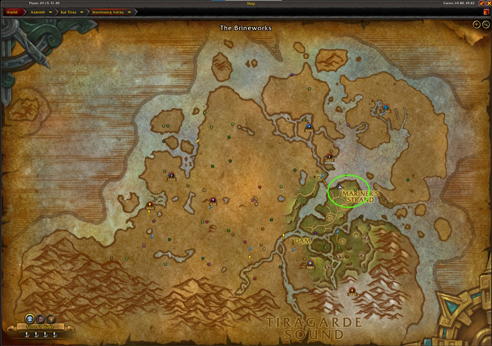
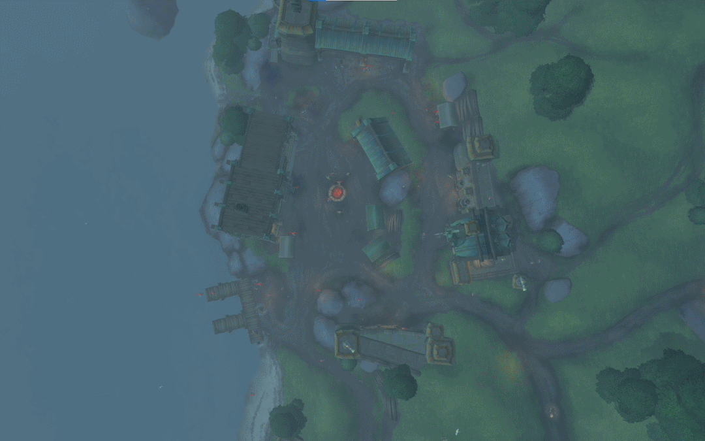

# Goldenmane's Reins

## The Farm
In this farm, you are going after the lucrative <WowHeadItem id="163573">Goldenmane's Reins</WowHeadItem>. This item has a very low drop chance from mobs in Stormsong Valley, so your goal is to kill as many mobs in Stormsong Valley as quickly and efficiently as possible.

This is best achieved by bringing 4 to 7 of your closest friends and head out to The Brineworks in Stormsong Valley.  You can do this farm as a solo player, however, it will not be nearly as effective as doing this in a group.  Even a group of 2 or 3 significantly increases your kill rates.

## Getting There

### Alliance
For the alliance, you can fly to to Mildenhall Meadery in Stormsong Valley and fly over from there.

### Horde
Take a boat to Kul Tiras and then fly to the Ironmaul Overlook.

## The Route
Your goal is to kill all the mobs in The Brineworks area as quickly as possible. If you have a monk in the group, have them place the Ox statue in the middle near the munitions and then send out 3 pullers to bring the mobs to the Ox statue.  The pullers will aggro as many mobs as possible and run in a loop, bringing them to the statue so they change aggro.  The mobs will start to hyperspawn if you are killing them fast enough.  

## The Notable Drops

- <WowHeadItem id="163573">Goldenmane's Reins</WowHeadItem>
- <WowHeadItem id="161344">Abyssal Fragment</WowHeadItem> from Tideguard Pontus

## Links
- [Boophie - Goldenmane's Reins Farm Spot Guide](https://www.youtube.com/watch?v=rwbHwf1H_5k)
- [Tharun Gaming](https://www.youtube.com/watch?v=7uZ_Y3zeCdY&t=474s)