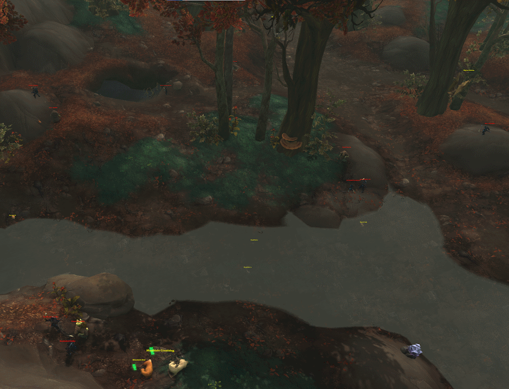

# The Terrified Pack Mule

## The Farm
In this farm, you are going after the elusive <WowHeadItem id="163574">Chewed-On Reins of the Terrified Pack Mule</WowHeadItem>. This item has a very low drop chance from Hexthralled mobs in Drustvar, so your goal is to kill as many Hexthralled mobs in Drustvar as quickly and efficiently as possible.

This is best achieved by bringing 4 to 7 of your closest friends and head out to Barrowknoll Cemetery in Drustvar.

## Getting There

### Alliance
For the alliance, you can take the flight path to to Fallhaven in Drustvar and fly over from there.

### Horde
Take a boat to Drustvar and then fly over to the Barrowknoll Cemetery.

## The Route
Your goal is to kill all the Hexthralled mobs in the area as quickly as possible. If you have a monk, have them place the Ox statue at the entrance to the cave and then send out 3 pullers to bring the mobs to the Ox statue.  The pullers will aggro as many mobs as possible and run in a loop, bringing them to the statue so they change aggro. One puller should manage the cave, looping back and forth between the back and the Ox.  The mobs will start to hyperspawn if you are killing them fast enough.  

## The Notable Drops

- <WowHeadItem id="163574">Chewed-On Reins of the Terrified Pack Mule</WowHeadItem>

## Links
- [Studen Albatroz](https://www.youtube.com/watch?v=uU3uwY5czzo)
- [Boophie](https://www.youtube.com/watch?v=eOzVZ4HMctg)
- [DalaGG](https://youtu.be/5OmOpZFJJrg?t=244)