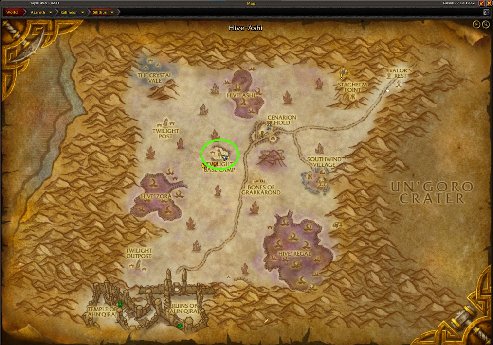
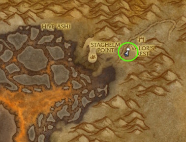
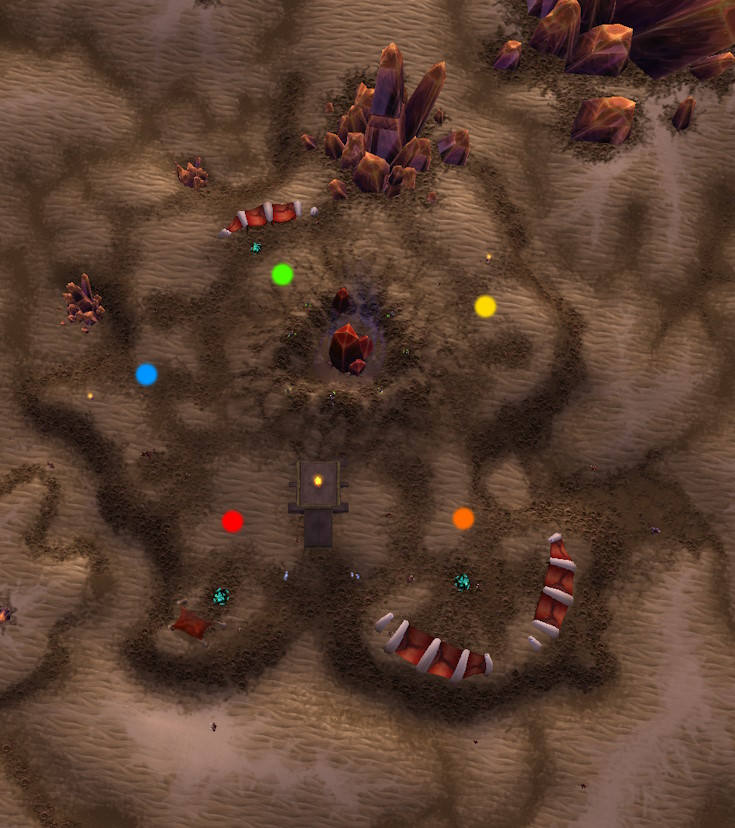
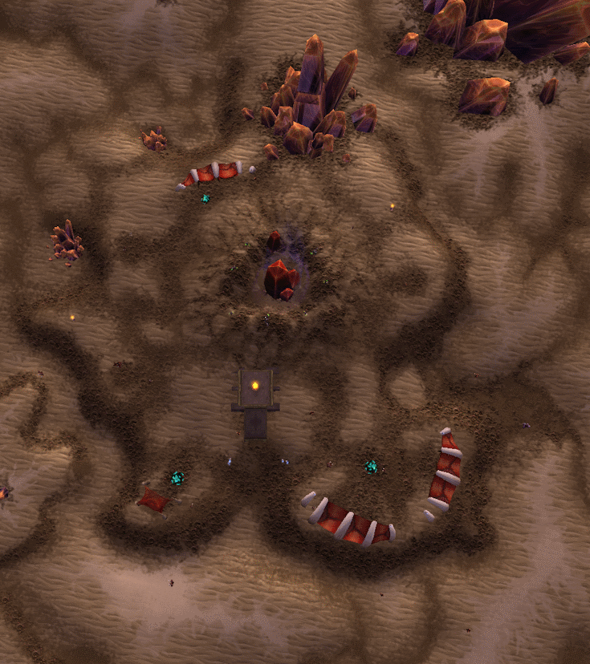

import PoolHigh from "@site/shared-content/poolhigh.mdx"

# Silithus

## The Farm
The Silithus farm is a general purpose transmog farm with a large loot table that can help you really fill out your auction house.  You are targeting the Twilight humanoids around the base camp. Some examples of high value items you will find on this farm are:

- <WowHeadItem id="14554">Cloudkeeper Legplates</WowHeadItem>
- <WowHeadItem id="14970">Glorious Legplates</WowHeadItem>
- <WowHeadItem id="1168">Skullflame Shield</WowHeadItem>
- <WowHeadItem id="14859">Vanguard Legplates</WowHeadItem>
- <WowHeadItem id="13036">Assassination Blade</WowHeadItem>

The farm is located in the zone of <WowHeadZone id="1377">Silithus</WowHeadZone> at the Twilight Base Camp.

## Getting There
If you completed some Battle For Azeroth content, then you have easy access to a portal to Silithus from either <WowHeadZone id="8670">Dazar'alor</WowHeadZone> or <WowHeadZone id="8568">Boralus</WowHeadZone>. Silithus is a zone that has multiple phases. If you are in the phase with the large sword in the land, you need to switch your zones by flying to Zidormi in the northeast corner of the zone (as denoted by the speech bubble).

Note: If you don't have the portals from your BFA capital, you can take the cataclysm portal to Uldum and fly over from there.

## The Route
You have two options with the route on this farm. You can setup your five man group to have assigned locations and everyone kills for 90 seconds then loots for 30, or you can do a continuous loop of killing and looting.  The former method takes more coordination, but you might get a slightly higher kill per hour count.

To setup the assigned locations farm, spread out the team evenly around the geode in the center.  Note that some of the people may have to move a bit to get some of the outliers into their range, but they should stay relatively close to their marker.

If you want to take the kill and loot as you go approach, you can assign people to do loops around the area and spread out evenly, so there is minimal overlap when running.  With a full group, it usually makes sense to have 3 going clockwise and 2 going counter-clockwise.

## The Notable Drops

### World Drops
These world drops can be obtained from the Silithus mobs, but the drop rate is going to be very low.
<PoolHigh />

### Sets
Many (but not all) items from these sets drop in the Silithus farm.  If you are farming for a specific item, check it's drop list.

- [Archnidian](/misc/sets#archnidian)
- [Bloodlust](/misc/sets#bloodlust)
- [Bonecaster's](/misc/sets#bonecasters)
- [Celestial](/misc/sets#celestial)
- [Eternal](/misc/sets#eternal)
- [Exalted](/misc/sets#exalted)
- [Glorious](/misc/sets#glorious)
- [Grand](/misc/sets#grand)
- [Heroic](/misc/sets#heroic)
- [High Chief's](/misc/sets#highchiefs)
- [Highborne](/misc/sets#highborne)
- [Impenetrable](/misc/sets#impenetrable)
- [Indomitable](/misc/sets#indomitable)
- [Jade](/misc/sets#jade)
- [Jadefire](/misc/sets#jadefire)
- [Keeper's](/misc/sets#keepers)
- [Lofty](/misc/sets#lofty)
- [Magnificent](/misc/sets#magnificent)
- [Merciless](/misc/sets#merciless)
- [Opulent](/misc/sets#opulent)
- [Peerless](/misc/sets#peerless)
- [Potent](/misc/sets#potent)
- [Praetorian](/misc/sets#praetorian)
- [Pridelord](/misc/sets#pridelord)
- [Protector](/misc/sets#protector)
- [Resplendent](/misc/sets#resplendent)
- [Sunscale](/misc/sets#sunscale)
- [Supreme](/misc/sets#supreme)
- [Vanguard](/misc/sets#vanguard)
- [Venomshroud](/misc/sets#venomshroud)
- [Warleader's](/misc/sets#warleaders)
- [Warstrike](/misc/sets#warstrike)