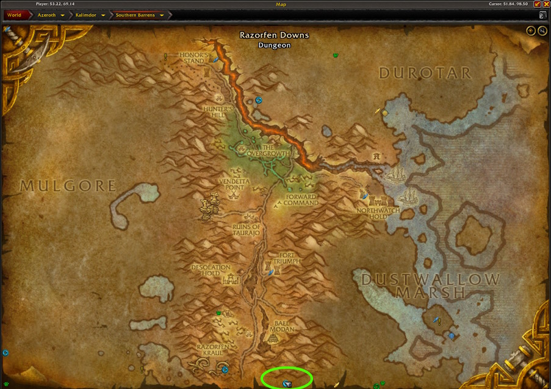
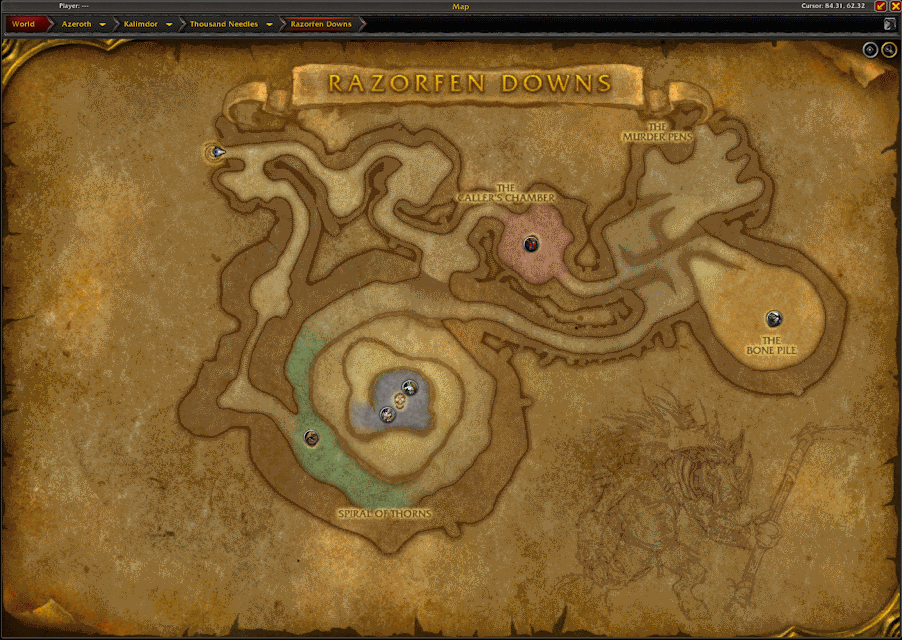
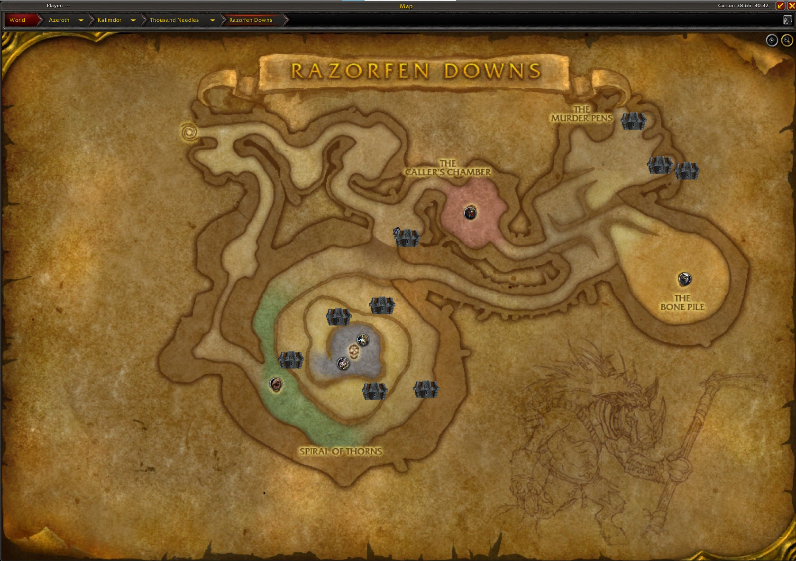
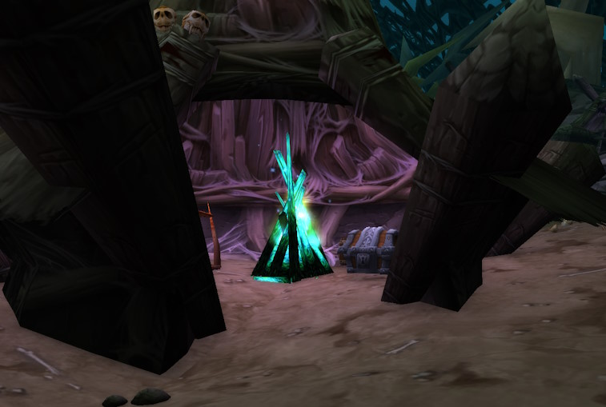

import PoolLow from "../../shared-content/poollow.mdx"
import Ancient from '../../shared-content/sets/ancient.mdx';
import Collapse from '@site/src/components/Collapse'
/* import Bloodforged from '../../shared-content/sets/bloodforged.mdx';
import Bloodwoven from '../../shared-content/sets/Bloodwoven';
import Bonelink from '../../shared-content/sets/Bonelink';
import Embersilk from '../../shared-content/sets/Embersilk';
import Geomancer from '../../shared-content/sets/Geomancer';
import Marauder from '../../shared-content/sets/Marauders';
import Saltstone from '../../shared-content/sets/Saltstone';
import Steadfast from '../../shared-content/sets/Steadfast';
import Symbolic from '../../shared-content/sets/Symbolic';
import Tricksters from '../../shared-content/sets/Trickster';
import Tyrants from '../../shared-content/sets/Tyrant';*/

## The Farm
Razorfen Downs (aka RFD) is a great dungeon to get you started in the world of transmog.  It's a relatively short dungeon that you can easily finish 10 runs in under an hour. It has a pretty wide loot table and enough mobs that can help you add some girth to your auction house.  Some examples of high value items you can get from RFD are:

- <WowHeadItem id="10573"></WowHeadItem> 
- <WowHeadItem id="10574"></WowHeadItem> 
- <WowHeadItem id="10570"></WowHeadItem> 
- <WowHeadItem id="10584"></WowHeadItem> 

## Getting There
Razorfen Downs is located in the southeast corner of the  zone on Kalimdor.

### Alliance and Horde
Take the portal from Stormwind/Orgrimmar to the Caverns of Time. Fly to bootlegger outpost and take the flightpath there to Mudsproket in Dustwallow Marsh.  Then fly west from there and go down through the brambles to get to the entrance of the dungeon.

## The Route
Upon entering the dungeon, stick to the left wall and kill and loot all of the mobs along the way. For the entire dungeon, sticking to the left wall will probably get you to the right spot.

Note, you don't need to finish the final boss, as the roleplay does eat up some time and the extra single loot probably isn't worth it.  RFD also is a dungeon with a good chunk of possible treasure spawns that can either be locked or unlocked.  It's best to bring a character that can unlock chests (Rogue, Blacksmith, Jewelcrafter, or Inscription).  The possible treasure locations in the dungeon are as follows:

The chests in the circle path leading up to the boss will be in the various tents along the way, so be sure to check each tent.

## Notable Loot
<PoolLow />
### World Drops
These world drops can drop in this dungeon, but the chance of a drop is very low.

### RFD Specific Items
These items are unique drops to RFD.

- <WowHeadItem id="10573">Boneslasher</WowHeadItem>
- <WowHeadItem id="10582">Briar Tredders</WowHeadItem>
- <WowHeadItem id="10574">Corpseshroud</WowHeadItem>
- <WowHeadItem id="10581">Death's Head Vestment</WowHeadItem>
- <WowHeadItem id="10571">Ebony Boneclub</WowHeadItem>
- <WowHeadItem id="10572">Freezing Shard</WowHeadItem>
- <WowHeadItem id="10570">Manslayer</WowHeadItem>
- <WowHeadItem id="10567">Quillshooter</WowHeadItem>
- <WowHeadItem id="10583">Quillward Harness</WowHeadItem>
- <WowHeadItem id="10776">Silky Spider Cape</WowHeadItem>
- <WowHeadItem id="10584">Stormgale Fists</WowHeadItem>
- <WowHeadItem id="10578">Thoughtcast Boots</WowHeadItem>

### Sets
<Collapse title="Sets">
Many (but not all) items from these sets drop in Razorfen Downs.  If you are farming for a specific item, check it's drop list.

#### Ancient
<Ancient />
#### Bloodforged
</Collapse>
## Links
- [The Tired Llama](https://www.youtube.com/watch?v=9I4hfmiFkcg)
- [Azahrex](https://www.youtube.com/watch?v=VCLTwtnWVko&t=28s)