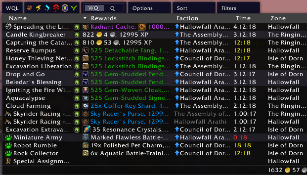
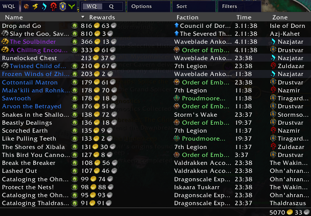
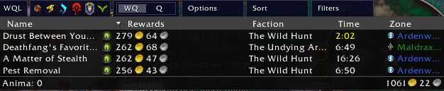

# World Quests
World quests in World of Warcraft are a decent way to make gold once an expansion has been established for a while. The basic approach to make gold with world quests is to establish an alt army with average gear.  

Your goal is to find a number of world quests that are easy to do and provide a decent sum of gold. The current expansion world quests offer the highest reward for completion, but older content may be viable, depending on your gold situation.  Once you have unlocked world quests on your main character, you can actually dual use world quests to help your alt army level up while you are also farming some gold.  Some quests directly just give you gold, while others, like the dragon riding quests, will give you a dragon riding purse that contains items and gold.

Most world quests reset twice per week, so for each alt in your alt army, you only have log them in twice per week to gather up the gold.

## Addons
To start it is recommended, but not required, to use a world quest addon like [World Quests List](https://www.curseforge.com/wow/addons/world-quests-list) to consolidate the list of world quests on your map. These make it very easy to scan the lists of world quests for a zone or all zones in an expansion and find the ones that will provide you the best options to obtain gold.

As you can see in this image, the World Quests Lists addon shows the rewards inline with the quests and even gives you a total gold amount for the raw gold quests in the bottom right corner (1632.57 in this case).

## Finding Quests

Using the World Quests Lists addon allows you to see all of the world quests and from there you can look to find quests that will net you some gold.  Also, Wowhead has world quest trackers for both the <a href="https://www.wowhead.com/world-quests/legion/na">NA</a> and <a href="https://www.wowhead.com/world-quests/legion/eu">EU</a> regions to allow you to track the world quests outside of the game if you so desire.

### Dragon Riding
Dragong Riding quests reward you with a <WowHeadItem id="227450">Sky Racer's Purse</WowHeadItem> which contains a small amount of gold (~150) and usually some sort of currency for the current patch (e.g. <a href="https://www.wowhead.com/currency=2815">Resonance Crystals</a> during The War Within). 

Dragon Riding quests are usually pretty quick (about 1 minute of riding) plus the travel time to get to each of the quests.  Each zone in the expansion will have one dragon riding quest up at a time and they reset twice per week.   

### Raw Gold
There are usually two raw gold quests up at a time within a given expansion.  For the most current expansion, the quests award in the area of 800 gold per quest. Previous expansions are a bit lower, falling off by a little less than half for each expansion you go back. You can see most of the expansions in one view in World Quests List if you zoom out to show all of Azeroth.

And then the only other expansion that has world quests is Shadowlands.

As you can see there is over 6000g worth of raw gold world quests up in my example.  Now obviously there is travel time to consider, but there is plenty of gold to be made just from running world quests across all of World of Warcraft.

